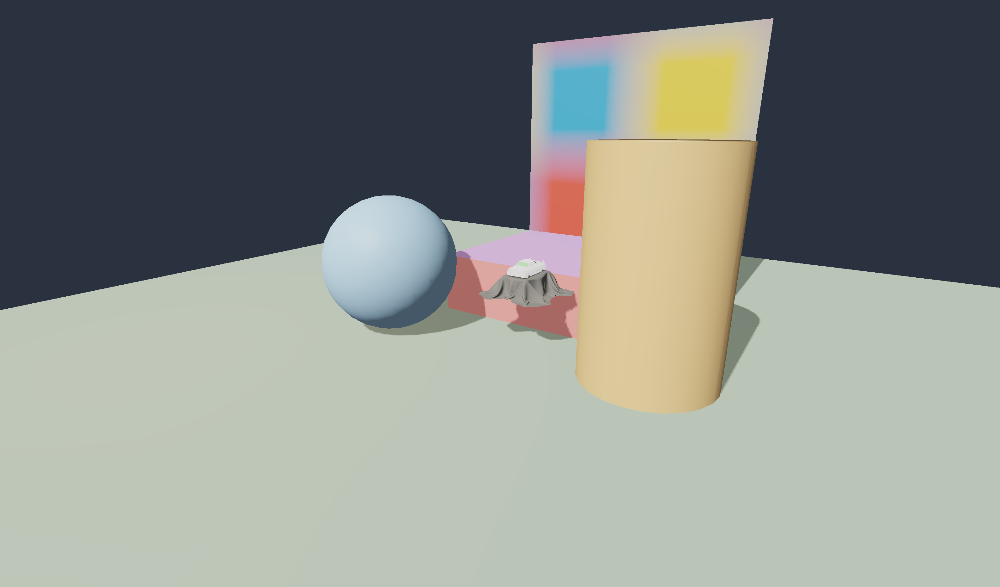

# Shared Content Showcase

This project is the Phase 5 cross-consumer fixture. Open `Project.kproject` in
KairoEditor or KairoPlayer; both hosts load the same `Showcase.kscene`, stable
asset manifest, imported Toy Car glTF hierarchy, authored camera, two lights,
environment, and native blockout geometry.



The Toy Car source is the approved Khronos glTF Sample Assets fixture already
tracked by Kairo's compatibility corpus. Its redistribution terms are copied to
`Content/ToyCar/LICENSE.md`. The GLB is intentionally project-local so packaged
runtime execution never depends on a source checkout outside the project root.

```bash
./build/dev-clang/KairoEditor/KairoEditorApp \
  Samples/SharedContentShowcase/Project.kproject

./build/dev-clang/Runtime/KairoPlayer/KairoPlayer \
  Samples/SharedContentShowcase/Project.kproject
```

The scene instance is serialized as one `scene-instance` component. Renderer
adapters expand its imported node transforms and per-primitive materials at
runtime while preserving the single persistent scene asset identity.

`TexturedPanel.gltf` is the controlled Phase 3 reference fixture. Its external
checker image is a registered texture dependency, imported as sRGB, uploaded by
Vulkan, sampled through UVs, and rendered identically by Editor and Player.

```bash
./build/dev-clang/KairoEditor/KairoEditorApp \
  --project Samples/SharedContentShowcase/Project.kproject \
  --frames 6 --screenshot build/dev-clang/shared-content-reference.ppm \
  --no-layout-persistence

./build/dev-clang/Runtime/KairoPlayer/KairoPlayer \
  Samples/SharedContentShowcase/Project.kproject --smoke
```

Reference SHA-256 values:

```text
ToyCar.glb    01a60862de55cd4b9f3acfab0b0def86451800f9c42467fcd61052c16cb9838c
checker.png   1cdc534b7837acb5af7941863873d03bbd8b27f43b13df03821142ab79bbbc66
capture.png   11ed7c801b20eb2a4580c6f22174f5ae50cda6a685c66c32e823107990afbb99
```
